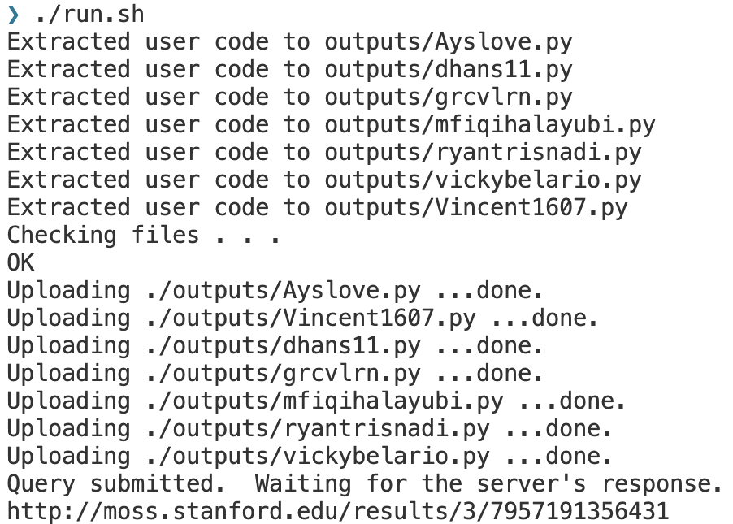
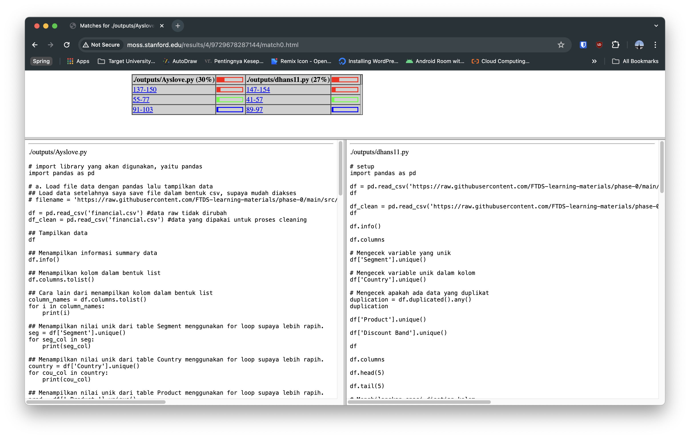

# MossPyt

A productivity tool that can do plagiarism check using Moss for all python assignment in github classroom.

## Requirements

- Moss account
    - Register Moss account ([here](https://theory.stanford.edu/~aiken/moss/))
        - To obtain a Moss account, send a mail message (without subject) to <moss@moss.stanford.edu>. The body of the
          message should appear like the format below:

            ```text
            registeruser
            mail username@domain <-- change this to your existing email
            ```

        - After receive reply from MOSS, proceed to copy the script from the email and save it as `moss.pl` to this
          project directory. The email should appear like this
          
        - Set permission on `moss.pl` using `chmod ug+x <file>`

            ```bash
            chmod ug+x moss.pl
            ```

- Python
- Selenium ([reference](https://selenium-python.readthedocs.io/installation.html)
- BeautifulSoup ([reference](https://www.crummy.com/software/BeautifulSoup/#Download)
- GitPython ([reference](https://github.com/gitpython-developers/GitPython))

## Setup

- Fill out `GH_USERNAME` and `GH_PASSWORD` in `.env` file

## Usage

- Execute the `run.sh` file in the terminal:
  ```bash
  ./run.sh
  ```
- Demo: https://youtu.be/x5LIh90blKs
- Ouput Example:
  
  

## Reference

- [Run MOSS Plagiarism Checker on Jupyter Notebooks](https://park.is/blog_posts/20230420_running_moss_plagiarism_checker)
  by Park Ye-Joo
