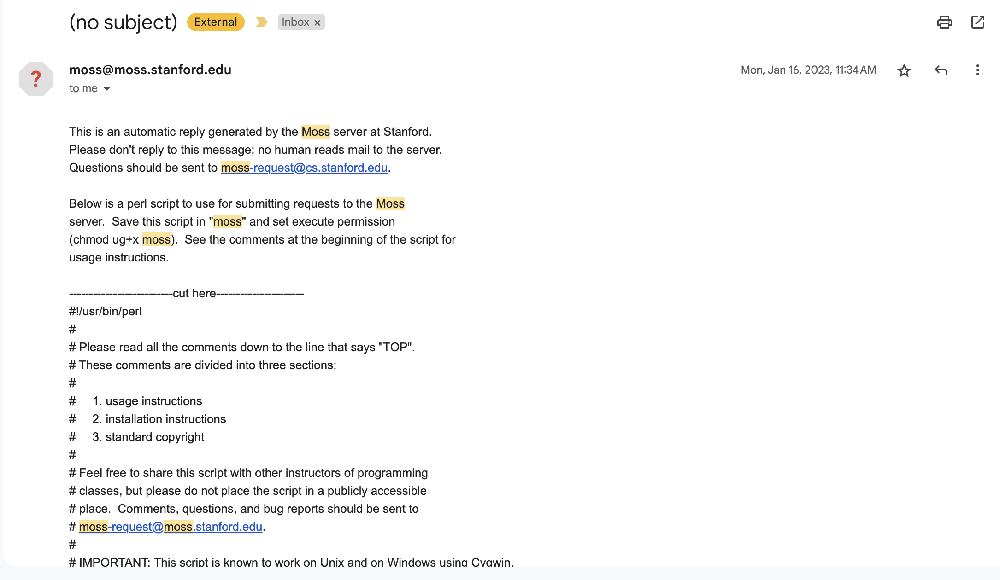

# Jupyter Notebook Moss Checker

Big thanks to Park Ye-Joo who writes an [article](https://park.is/blog_posts/20230420_running_moss_plagiarism_checker/) about `Run MOSS Plagiarism Checker on Jupyter Notebooks`. I decided to use the script to automate moss-checker on multiple repos.

## Setup

- Register MOSS account ([reference](https://theory.stanford.edu/~aiken/moss/))

    To obtain a Moss account, send a mail message (without subject) to <moss@moss.stanford.edu>. The body of the message should appear like the format below:

    ```text
    registeruser
    mail username@domain
    ```

    **note**: change `username@domain` to your email.
- After receive reply from MOSS, proceed to copy the script from the email and save it to `moss.pl` file

    > The email should appear like this
    

- Set permission on `moss.pl` using `chmod ug+x <file>`

    ```bash
    chmod ug+x moss.pl
    ```

**notes**: Don't change/modify the folder structure of this repo

## Usage

Execute the `run.sh` file in the terminal:

```bash
./run.sh
```

>Ouput Example:


## References

- [Run MOSS Plagiarism Checker on Jupyter Notebooks](https://park.is/blog_posts/20230420_running_moss_plagiarism_checker)
