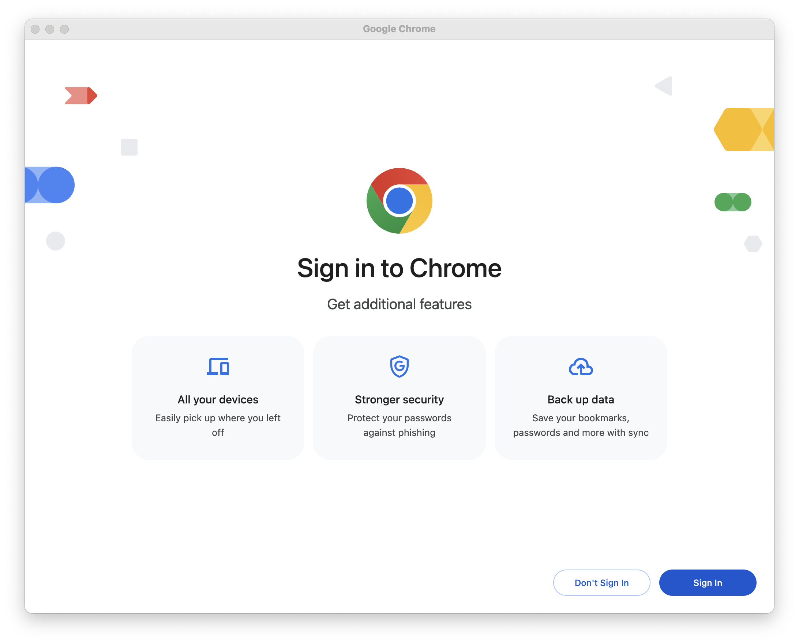

# MossPyt

A productivity tool that can do plagiarism check using Moss for all python assignment in github classroom.

## Requirements
- Chrome browser with RDP enabled
    > To run MossPyt, you must have Chrome installed and launch Chrome with Remote Debugging Port enabled. The reason why I use this approach is because, with RDP enabled, Chrome will store the login session of our GitHub Classroom account so that whenever we run this tool again it will automatically access the student assignments without having to re-authenticate.
    - Launch Chrome with RDP
        - Windows:
          ```bash
          /path/to/chrome --remote-debugging-port=port_number --user-data-dir=/path/to/any/directory/where/you/want/to/set/your/chrome/profile https://yoursite.com
          ```
        - Mac:
          ```
          /Applications/Google\ Chrome.app/Contents/MacOS/Google\ Chrome --remote-debugging-port=port_number --user-data-dir=/path/to/any/directory/where/you/want/to/set/your/chrome/profile https://yoursite.com
          ```
        - Example:
          ```bash
          # launch chrome and open classroom homepage
          /Applications/Google\ Chrome.app/Contents/MacOS/Google\ Chrome --remote-debugging-port=8989 --user-data-dir=~/chrome-rdp https://classroom.github.com/classrooms
          ```
    
    - When first launch Chrome with RDP, don't sync with your existing google account.
        
    
    - After that, make sure to have your GitHub Classroom account logged in.
        
- Moss account
    - Register Moss account ([here](https://theory.stanford.edu/~aiken/moss/))
      - To obtain a Moss account, send a mail message (without subject) to <moss@moss.stanford.edu>. The body of the message should appear like the format below:
        ```text
        registeruser
        mail username@domain <-- change this to your existing email
        ```
      - After receive reply from MOSS, proceed to copy the script from the email and save it as `moss.pl` to this project directory. The email should appear like this
        
      - Set permission on `moss.pl` using `chmod ug+x <file>`
        ```bash
        chmod ug+x moss.pl
        ```
- Python
- Selenium ([reference](https://selenium-python.readthedocs.io/installation.html)
- BeautifulSoup ([reference](https://www.crummy.com/software/BeautifulSoup/#Download)
- GitPython ([reference](https://github.com/gitpython-developers/GitPython))

## Setup
- Clone repo
- Add new `outputs` and `sources` directories.

## Usage
- Execute the `run.sh` file in the terminal:
  ```bash
  ./run.sh
  ```

  After running the script, it will ask for some input, such as:
    - Port Number: `<current_chrome_rdp_port>`
    - Classroom Assignment URL: `<assignment_url>`
    - Repo Prefix URL: `<repo_prefix_url>`
        - Example:
          - students repo URL
            ```https://github.com/FTDS-assignment-bay/p0-ftds017-hck-g1-Ayslove```
          - so the prefix will be
            ```https://github.com/FTDS-assignment-bay/p0-ftds017-hck-g1```
    - Select file format: `<file_format>` or leave blank for `.ipynb` file

- Ouput Example:
    
    

## Reference
- [Run MOSS Plagiarism Checker on Jupyter Notebooks](https://park.is/blog_posts/20230420_running_moss_plagiarism_checker) by Park Ye-Joo
- [Running Selenium Tests on an Already Opened Chrome Browser Using Python and Chrome DevTools Protocol](https://www.linkedin.com/pulse/running-selenium-tests-already-opened-chrome-browser-using-kabir) by Rasel Kabir
